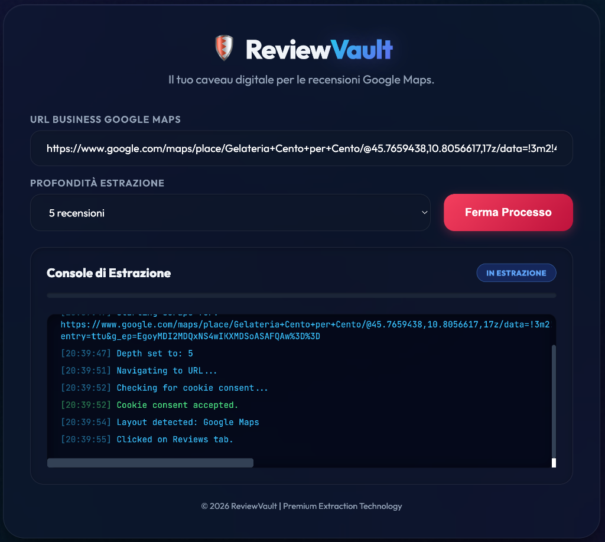
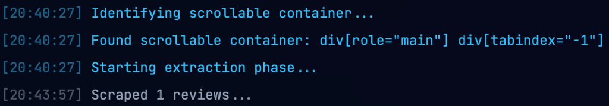
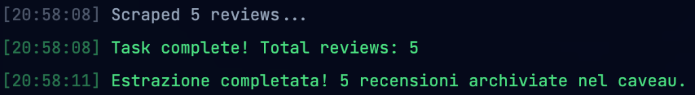
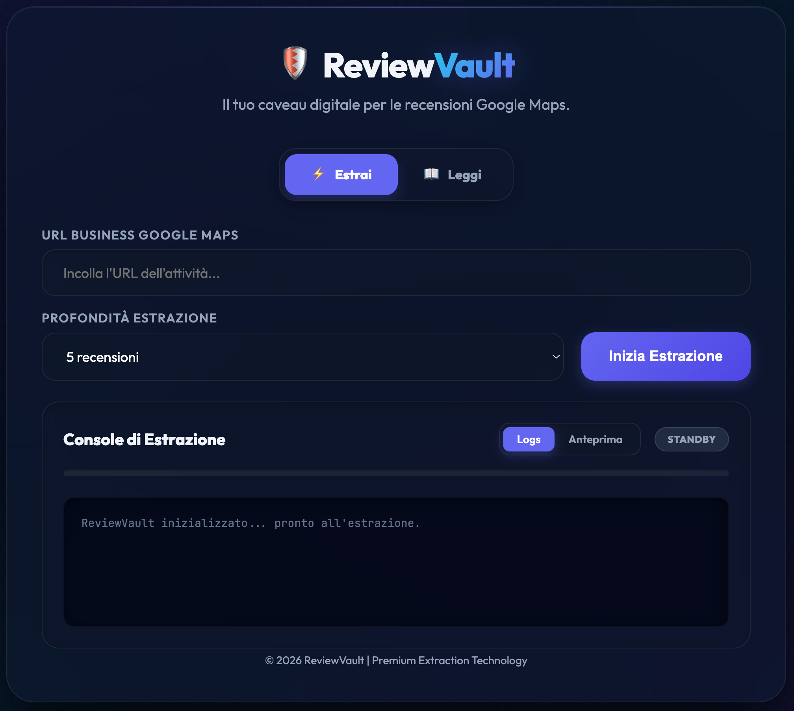
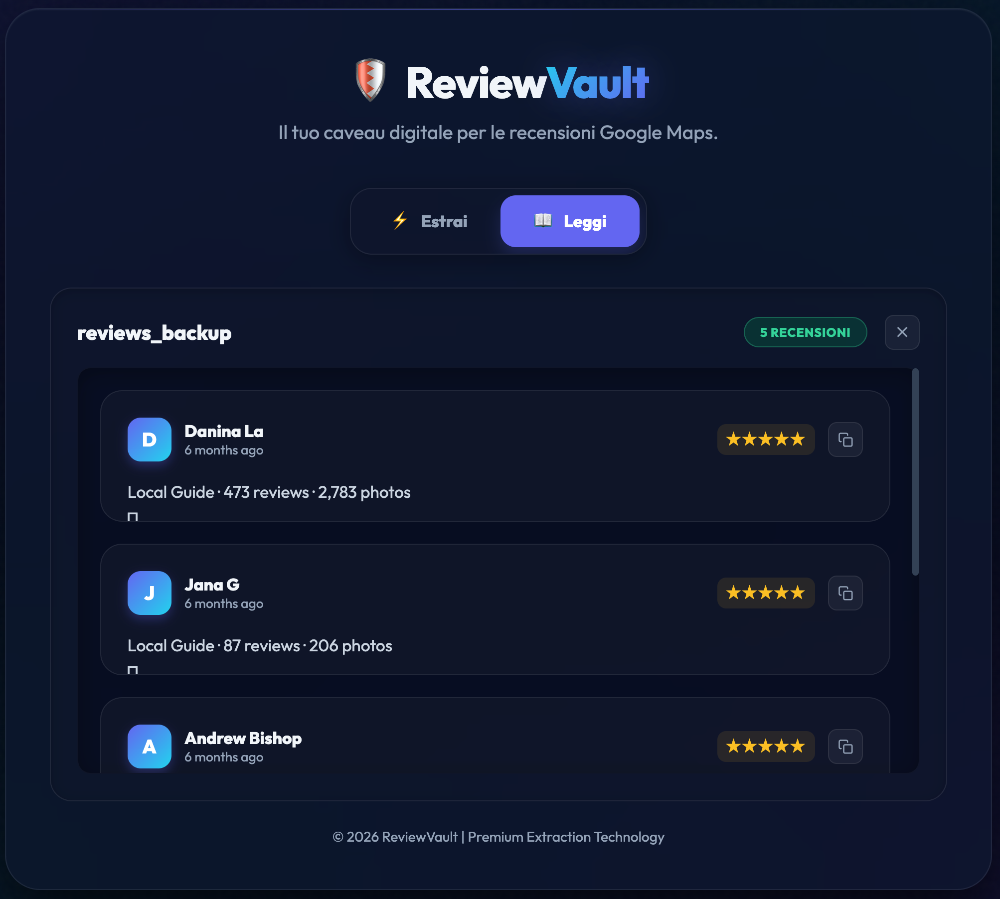

# 🛡️ ReviewVault: Premium Google Maps Review Scraper



**ReviewVault** is a high-performance, self-hosted web application designed to extract and archive Google Maps reviews with surgical precision. Featuring a state-of-the-art "Cyber Navy" interface and built on a robust extraction engine, it transforms public review data into structured JSON files ready for analysis.

---

### 🔍 Real-Time Monitoring & Feedback

ReviewVault provides absolute transparency during the extraction process with a dedicated live feedback system:

| **Terminal Logging System** | **Progress & Status Bar** |
|:---:|:---:|
|  |  |
| *Deep-level logs tracking every action* | *Visual progress and state indicators* |

---

### 💾 Data Export & Secure Archiving

Once the extraction is complete, ReviewVault notifies the user and provides a clean, professional download interface:

| **Task Completion Notification** | **Secure Export (.json)** |
|:---:|:---:|
|  |  |
| *Clear confirmation of data collection* | *Instant access to your digital vault* |

---

### 🔄 Dual-Mode Architecture: Extract & Read

ReviewVault is now a comprehensive review management system. Switch seamlessly between real-time data collection and offline analysis:

| **Mode: Estrai (Live)** | **Mode: Leggi (Vault Reader)** |
|:---:|:---:|
|  |  |
| *Scrape new reviews in real-time* | *Load and visualize your archived .json vaults* |

---

## 🚀 Key Features

- **🌐 Smart URL Resolution**: Full support for shortened `maps.app.goo.gl` links and automatic redirection handling.
- **⚡ Real-Time Streaming**: Watch the extraction process live through a terminal-style console powered by Socket.io.
- **🎭 Stealth Extraction**: Built-in bot detection bypass using Playwright-extra and stealth plugins.
- **🛡️ Graceful Interruption**: Manually close the browser window or stop the process at any time; ReviewVault will automatically flush and save all partial data collected.
- **📊 Custom Depth**: Choose exactly how many reviews to extract—from a quick sample of 5 to a deep scan of thousands.
- **💎 Premium UI**: Immersive desktop experience with glassmorphism effects, mesh gradients, and interactive components.
- **📂 Automatic Archiving**: All data is saved in structured JSON format within the `data/` vault for easy consumption.

---

## 🛠️ Technology Stack

- **Backend**: [Node.js](https://nodejs.org/) & [Express](https://expressjs.com/)
- **Scraper Engine**: [Playwright](https://playwright.dev/) with `stealth` plugins
- **Real-Time Communication**: [Socket.io](https://socket.io/)
- **Frontend**: Vanilla JS (ES6+), CSS3 (Glassmorphism & Flexbox)
- **Data Integrity**: [fs-extra](https://github.com/jprichardson/node-fs-extra) for robust file management

---

## 📥 Installation

1. **Clone the repository**:
   ```bash
   git clone https://github.com/simo-hue/ReviewVault.git
   cd ReviewVault
   ```

2. **Install dependencies**:
   ```bash
   npm install
   ```

3. **Install Playwright Browsers**:
   ```bash
   npx playwright install chromium
   ```

---

## 🚥 Quick Start

1. **Launch the Vault**:
   ```bash
   npm run dev
   ```

2. **Access the Interface**:
   Open [http://localhost:3000](http://localhost:3000) in your professional workstation.

3. **Choose your Target**:
   Paste a Google Maps Business URL (e.g., [this demo activity](https://maps.app.goo.gl/U8NvpizqYnwUf1U9A)), select your extraction depth, and hit **Inizia Estrazione**.

4. **Download your Data**:
   Once finished, click the **Scarica Caveau (.json)** button to secure your results.

---

## 📸 Demo Case

Try the scraper with this example activity:
🔗 [**Demo Target: Google Maps Business**](https://maps.app.goo.gl/U8NvpizqYnwUf1U9A)

---

## 📂 Project Structure

```text
├── data/               # The Vault: JSON results storage
├── public/             # Frontend assets (HTML, CSS, JS)
│   ├── index.html      # Main Dashboard
│   ├── style.css       # Premium Design System
│   └── app.js          # WebSocket Client Logic
├── scraper.js          # Core Playwright Extraction Engine
├── server.js           # Node/Express & Socket.io Server
└── package.json        # Dependencies & Scripts
```

---

## 📜 License

Distributed under the MIT License. See [LICENSE](LICENSE) for more information.

---
*Developed for excellence in data extraction. © 2026 ReviewVault.*
